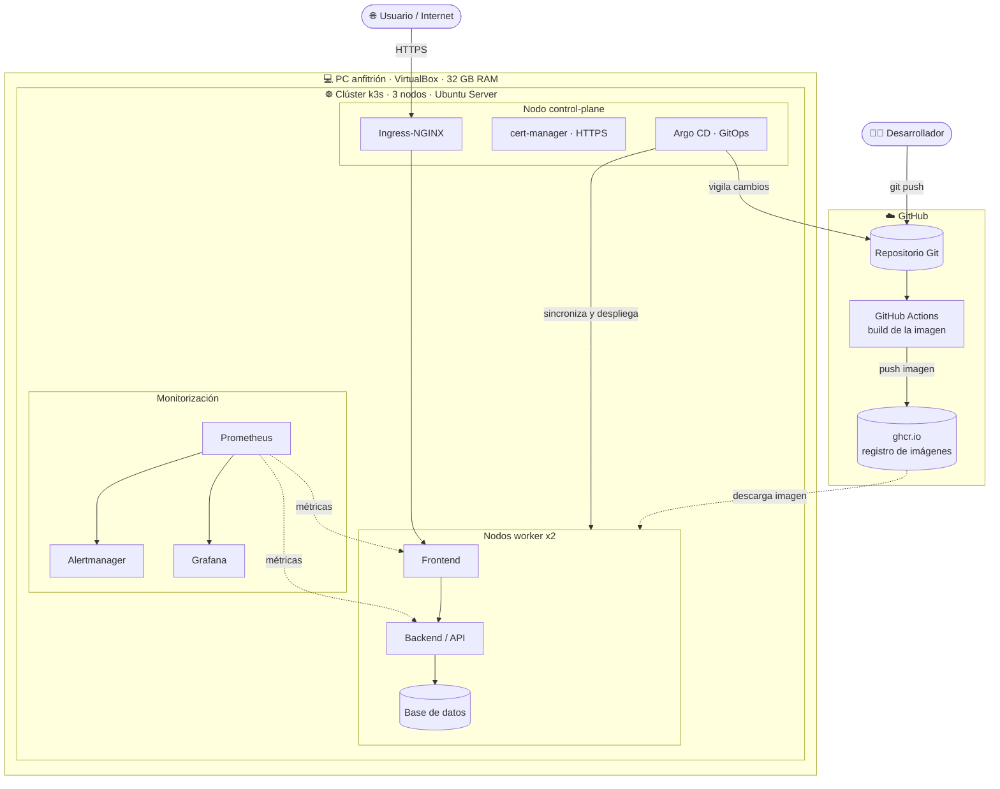

# Arquitectura del sistema

## Visión general

El proyecto despliega un entorno de producción simulado sobre **3 máquinas virtuales** (VirtualBox)
que forman un **clúster de Kubernetes (k3s)**. Sobre él se ejecuta una aplicación multiservicio,
accesible por **HTTPS** desde el exterior, que se despliega automáticamente mediante **CI/CD (GitOps)**
y se vigila con un stack de **monitorización**.

## Diagrama

## Componentes por capa

| Capa | Componente | Función |
|------|-----------|---------|
| Virtualización | VirtualBox | Hospeda las 3 VMs |
| Sistema operativo | Ubuntu Server LTS | SO de cada nodo |
| Orquestación | k3s | Clúster Kubernetes de 3 nodos |
| Red del clúster | Flannel (CNI) + MetalLB | Comunicación entre pods y balanceador de carga |
| Entrada | Ingress-NGINX | Punto único de entrada HTTP/HTTPS |
| Certificados | cert-manager + Let's Encrypt | Emite y renueva los certificados HTTPS |
| Aplicación | (a definir en Fase 4) | Servicios frontend, backend y base de datos |
| CI/CD | GitHub Actions + Argo CD | Construye la imagen y la despliega (GitOps) |
| Monitorización | Prometheus + Grafana + Alertmanager | Métricas, dashboards y alertas |

## Plan de red (provisional, se confirma en la Fase 1)

Cada VM tendrá **dos adaptadores**: uno **NAT** (salida a internet para descargas) y uno
**Host-Only** (comunicación interna del clúster).

| Nodo | Rol | IP (red Host-Only `192.168.56.0/24`) |
|------|-----|--------------------------------------|
| `k3s-server` | control-plane | 192.168.56.10 |
| `k3s-agent-1` | worker | 192.168.56.11 |
| `k3s-agent-2` | worker | 192.168.56.12 |
| Rango MetalLB | IPs para servicios | 192.168.56.200 – 192.168.56.250 |

## Flujo de despliegue automático (CI/CD)

1. El desarrollador hace `git push` al repositorio en GitHub.
2. **GitHub Actions** construye la imagen de la aplicación y la sube al registro (`ghcr.io`).
3. **Argo CD**, que vigila el repositorio, detecta el cambio y **sincroniza** el clúster.
4. Kubernetes descarga la nueva imagen y actualiza los pods, **sin intervención manual**.

## Flujo de monitorización

1. **Prometheus** recolecta métricas de los nodos, del clúster y de la aplicación.
2. **Grafana** las representa en dashboards.
3. **Alertmanager** envía alertas cuando se incumple una regla (ej. un servicio caído).